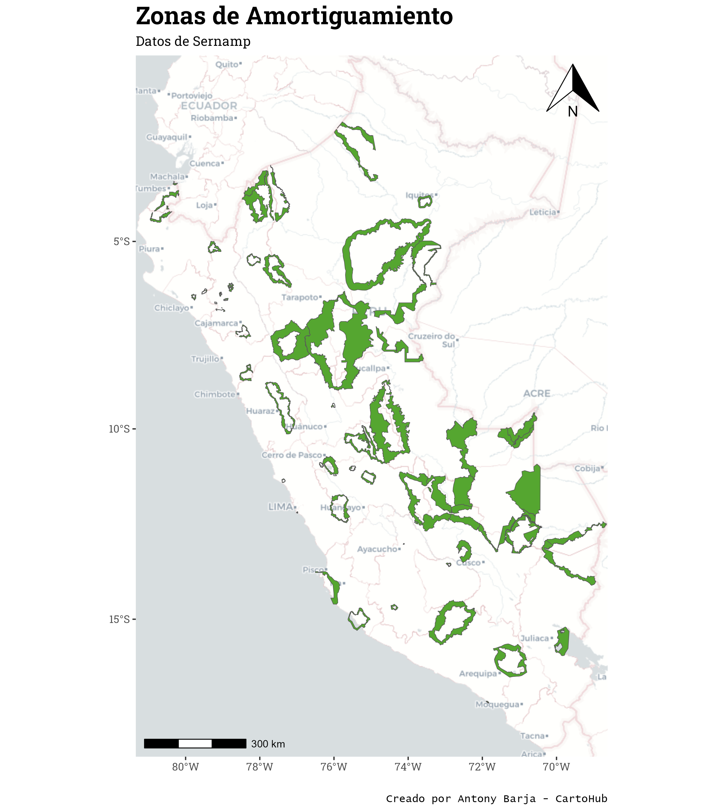

# CartoTip-01
🌐 `arcgislayer` es un paquete de R recientemente publicado en CRAN por Josiah Parry. Este paquete permite a los usuarios de 'ArcGIS Enterprise', 'ArcGIS Online' o 'ArcGIS Platform' leer, escribir, publicar o gestionar datos vectoriales y ráster a través de los puntos finales de la API REST de servicios de ArcGIS.

Aquí un pequeño ejemplo de cómo puedes usarlo:
 - 📜script: [enlace al repositorio](https://github.com/cartohub/cartotip/blob/main/cartotip-01/cartotip-01.R)

¡No olvides de compartir y seguir nuestras redes sociales!
#cartohub #cartotip #arcgis #mapas #GIS #cartografia #geografia 🗺️📊🔍
